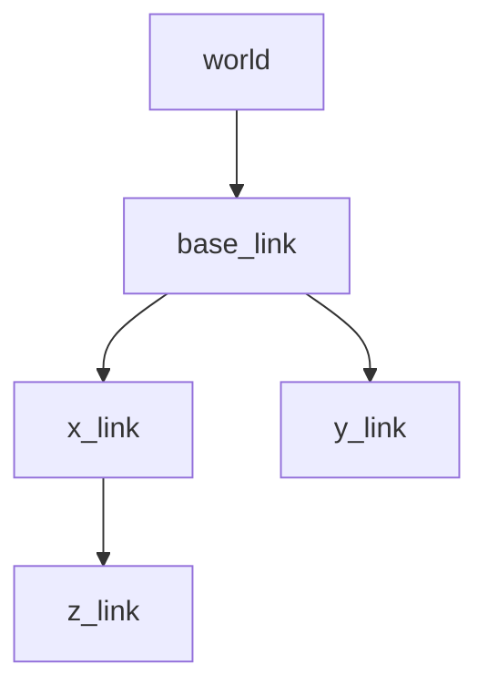

# Zaber Description

[](https://opensource.org/licenses/Apache-2.0)

## Table of Contents

1. [Overview](#overview)
2. [Package Structure](#package-structure)
3. [URDF Description](#urdf-description)
4. [Dependencies](#dependencies)
5. [Installation](#installation)
6. [Launch Files](#launch-files)
7. [ROS2 Control Configuration](#ros2-control-configuration)
8. [Visualization](#visualization)
9. [Troubleshooting](#troubleshooting)

## Overview

The Zaber Description package provides URDF/XACRO robot description files, visual meshes, and launch configurations for Zaber linear motion systems. It enables visualization in RViz and provides the necessary robot description for ROS2 Control integration.

## Package Structure

```plaintext
zaber_description/
├── urdf/
│   ├── zaber.urdf.xacro        # Main robot description
│   ├── zaber_macro.xacro       # Link/joint definitions
│   └── zaber.ros2_control.xacro # Control configuration
├── meshes/
│   ├── zaber_lmh_x.stl         # X-axis stage mesh
│   ├── zaber_lmh_y.stl         # Y-axis stage mesh
│   └── zaber_vsr_z.stl         # Z-axis stage mesh
├── launch/
│   └── view.launch.py          # Visualization launch
├── rviz/
│   └── view_robot.rviz         # RViz configuration
└── CMakeLists.txt
```

## URDF Description

### Robot Structure



### Joints Configuration

1. Insertion Joint (Y-axis)

   ```xml
   <joint name="insertion_joint" type="prismatic">
     <parent link="base_link"/>
     <child link="y_link"/>
     <axis xyz="0.0 1.0 0.0"/>
     <limit lower="0.0" upper="0.1"/>
   </joint>
   ```

2. Horizontal Joint (X-axis)

   ```xml
   <joint name="horizontal_joint" type="prismatic">
     <parent link="base_link"/>
     <child link="x_link"/>
     <axis xyz="1.0 0.0 0.0"/>
     <limit lower="-0.05" upper="0.05"/>
   </joint>
   ```

3. Vertical Joint (Z-axis)

   ```xml
   <joint name="vertical_joint" type="prismatic">
     <parent link="x_link"/>
     <child link="z_link"/>
     <axis xyz="0.0 0.0 1.0"/>
     <limit lower="0.0" upper="0.05"/>
   </joint>
   ```

## Dependencies

### Required Packages

```xml
<buildtool_depend>ament_cmake</buildtool_depend>
<depend>joint_state_publisher_gui</depend>
<depend>launch</depend>
<depend>robot_state_publisher</depend>
<depend>rviz2</depend>
<depend>urdf</depend>
<depend>xacro</depend>
```

## Installation

1. Install dependencies:

    ```bash
    sudo apt install ros-$ROS_DISTRO-joint-state-publisher-gui
    sudo apt install ros-$ROS_DISTRO-xacro
    ```

2. Build the package:

    ```bash
    colcon build --packages-select zaber_description
    ```

3. Source the workspace:

    ```bash
    source install/setup.bash
    ```

## Launch Files

### Visualization Launch

```bash
ros2 launch zaber_description view.launch.py
```

### Launch Arguments

```bash
# Custom description package
ros2 launch zaber_description view.launch.py description_package:=custom_zaber_description

# Custom URDF file
ros2 launch zaber_description view.launch.py description_file:=custom_zaber.urdf.xacro

# With TF prefix
ros2 launch zaber_description view.launch.py tf_prefix:=zaber_1
```

## ROS2 Control Configuration

### Hardware Interface Configuration

```xml
<ros2_control name="${name}" type="system">
  <hardware>
    <plugin>zaber_driver/ZaberSystemHardwareInterface</plugin>
  </hardware>

  <joint name="horizontal_joint">
    <command_interface name="position">
      <param name="min">-0.05</param>
      <param name="max">0.05</param>
    </command_interface>
    <command_interface name="velocity">
      <param name="min">-0.01</param>
      <param name="max">0.01</param>
    </command_interface>
    <state_interface name="position"/>
  </joint>

  <!-- Similar configuration for other joints -->
</ros2_control>
```

### Initial Positions

```xml
<xacro:macro name="zaber_ros2_control" params="
    name
    initial_positions:=${dict(
      insertion_joint=0.0,
      horizontal_joint=0.0,
      vertical_joint=0.0)}">
  <!-- Configuration content -->
</xacro:macro>
```

## Visualization

### RViz Configuration

The package includes a default RViz configuration with:

- Robot model display
- TF visualization
- Joint state visualization
- Grid reference

### Mesh Files

The package includes STL files for:

- X-axis linear stage (LHM series)
- Y-axis linear stage (LHM series)
- Z-axis vertical stage (VSR series)

### Frame Convention

```plaintext
world                 # Fixed world frame
└── base_link        # Robot base frame
    ├── x_link       # Horizontal stage
    ├── y_link       # Insertion stage
    └── z_link       # Vertical stage
```

## Troubleshooting

### Common Issues

1. Missing Meshes

    ```plaintext
    Problem: "Could not locate mesh file"
    Solution:
    - Verify mesh files in meshes/ directory
    - Check file permissions
    - Confirm package installation
    ```

2. URDF Load Errors

    ```plaintext
    Problem: "Failed to load URDF"
    Solution:
    - Check XACRO syntax
    - Verify file paths
    - Validate macro parameters
    ```

3. Visualization Issues

    ```plaintext
    Problem: "TF tree incomplete"
    Solution:
    - Check joint_state_publisher
    - Verify URDF connections
    - Monitor robot_state_publisher
    ```

### Debugging Tools

```bash
# Check URDF syntax
check_urdf /path/to/generated.urdf

# Validate XACRO
xacro --xacro-file /path/to/zaber.urdf.xacro --check-cycles

# View TF tree
ros2 run tf2_tools view_frames

# Monitor joint states
ros2 topic echo /joint_states
```

### Configuration Validation

```bash
# Print expanded URDF
ros2 run xacro xacro $(ros2 pkg prefix zaber_description)/share/zaber_description/urdf/zaber.urdf.xacro

# List available frames
ros2 run tf2_tools view_frames.py

# Check model plugin loading
ros2 run controller_manager spawner --stopped joint_state_broadcaster
```
